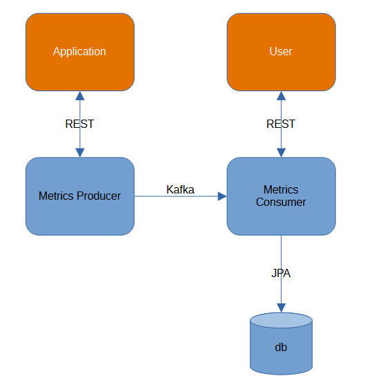

[](https://github.com/AlekseiPetrovJ/kafka/actions/workflows/maven.yml)

# Spring Boot приложение системы мониторинга с использованием Spring Kafka

Система мониторинга состоит из трех модулей: 
- producer - микросервис принимает JSON с метриками и отправляет их в Kafka топик "metrics-topic". Реализует POST метод для регистрации метрик;
- consumer - микросервис из топика Kafki получает JSON с метриками и записывает их в базу данных. Реализует GET методы для получения записей метрик. 
- generator - периодически запрашивает метрику uptime и некоторые значения памяти. Отправляет полученные метрики посредством Post запроса в МС producer



[Полный текст технического задания](OpenSchoolDz3.txt)

### Моделирование работы приложения

**Generator** - запрашивает значение метрик и отправляет через POST метод в микросервис **Producer**. 
Периодичность сбора настраивается в [application.yml](generator%2Fsrc%2Fmain%2Fresources%2Fapplication.yml) в параметре fixedRateв миллисекундах.

Так же вы можете передать значение метрики через POST метод в микросервисе **Producer**.

Из **Producer** метрика будет передана через Kafka в микросервис **Consumer**, где будет записано в базу данных Postgresql. 

Посмотреть значение метрик можно в МС **Consumer**.

База данных поставляется с демонстрационными значениями метрик, которые вносятся посредством Liquibase.

## API

### Producer

POST /metrics: Отправка метрик работы приложения в формате JSON

### Consumer

GET /metrics: Получение списка всех метрик. (реализована пагнация и сортировка)

GET /metrics/{id}: Получение конкретной метрики по ее идентификатору.

## Запуск демонстрационного приложения

### Системные требования
Установленные java 21, maven, docker, docker compose.

### Установка стартера в локальный maven репозиторий

1) Скачайте проект из ветки master

2) Сборка приложения, установка в локальный maven репозиторий
   - Перейдите в каталог модуля **Producer**. Соберите докер образ:

   windows:
    ```bash
    cd .\producer\ ; ./mvnw.cmd -B clean package dockerfile:build ; cd ..\
    ```
   linux:
   ```bash
   cd .\producer\ && ./mvnw -B clean package dockerfile:build && cd ..\
   ```
   - Перейдите в каталог модуля **Consumer**. Соберите докер образ:
   
   windows:
   ```bash
   cd ..\consumer\ ; ./mvnw.cmd -B clean package dockerfile:build ; cd ..\
   ```

   linux:
   ```bash
   cd ..\consumer\ && ./mvnw -B clean package dockerfile:build && cd ..\
   ```
   - Опционально. Перейдите в каталог модуля **Generator**. Соберите докер образ:
   
   windows:
   ```bash
   cd ..\generator\ ; ./mvnw.cmd -B clean package dockerfile:build ; cd ..\
   ```
   
   linux:
   ```bash
   cd ..\generator\ && ./mvnw -B clean package dockerfile:build && cd ..\
   ```

3) Запуск проекта:

```bash
docker compose up
```

### Запуск демо-приложения с REST контроллером

Для генерации запросов GET и POST воспользуйтесь swagger-ui.
В результате логи запросов и ответов к REST контроллеру будут выводиться в консоль и сохранятся файл restExample.log

### OpenAPI демо-приложения

После запуска демо-приложения становится доступным OpenApi:

http://localhost:8081/swagger-ui/index.html - **Consumer**

http://localhost:8080/swagger-ui/index.html - **Producer**

