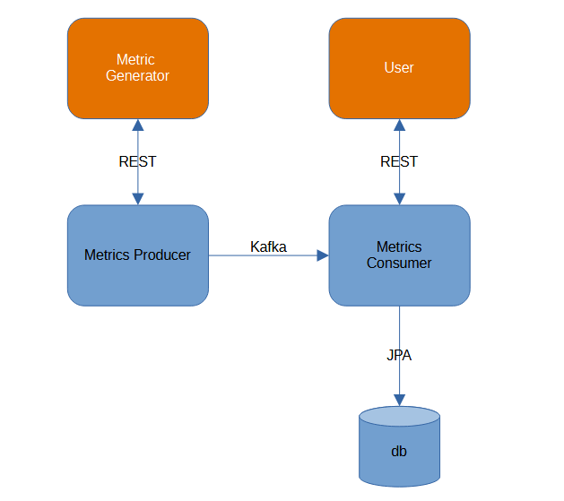

# Spring Boot приложение системы мониторинга с использованием Spring Kafka

Система мониторинга состоит из двух модулей: 
- producer - микросервис принимает JSON с метриками и отправляет их в Kafka топик "metrics-topic". Реализует POST метод для регистрации метрик;
- consumer - микросервис из топика Kafki получает JSON с метриками и записывает их в базу данных. Реализует GET методы для получения записей метрик. 



[Полный текст технического задания](OpenSchoolDz3.txt)

## API

### Producer

POST /metrics: Отправка метрик работы приложения в формате JSON

### Consumer

GET /metrics: Получение списка всех метрик. (реализована пагнация и сортировка)

GET /metrics/{id}: Получение конкретной метрики по ее идентификатору.

## Запуск демонстрационного приложения

### Системные требования
Установленные java 21, maven, docker, docker compose.

### Установка стартера в локальный maven репозиторий

1) Скачайте проект из ветки master

2) Сборка приложения, установка в локальный maven репозиторий
   1) Перейдите в каталог модуля producer

    ```bash
    cd .\producer\
    ```

    2) Соберите докер образ:
    
   windows:
    ```bash
    ./mvnw.cmd -B clean package dockerfile:build
    ```
    linux:
    ```bash
    ./mvnw -B clean package dockerfile:build
    ```
   3) Перейдите в каталог модуля consumer

    ```bash
    cd ..\consumer\
    ```

   4) Соберите докер образ:

    windows:
    ```bash
    ./mvnw.cmd -B clean package dockerfile:build
    ```
    
    linux:
    ```bash
    ./mvnw -B clean package dockerfile:build
    ```

3) Запуск проекта:
Перейдите в корень приложения 
```bash
cd ..\
```
Запустите проект
```bash
docker compose up
```

### Запуск демо-приложения с REST контроллером

Для генерации запросов GET и POST воспользуйтесь swagger-ui.
В результате логи запросов и ответов к REST контроллеру будут выводиться в консоль и сохранятся файл restExample.log

### OpenAPI демо-приложения

После запуска демо-приложения становится доступным OpenApi:

http://localhost:8081/swagger-ui/index.htm - consumer
http://localhost:8080/swagger-ui/index.htm - producer
